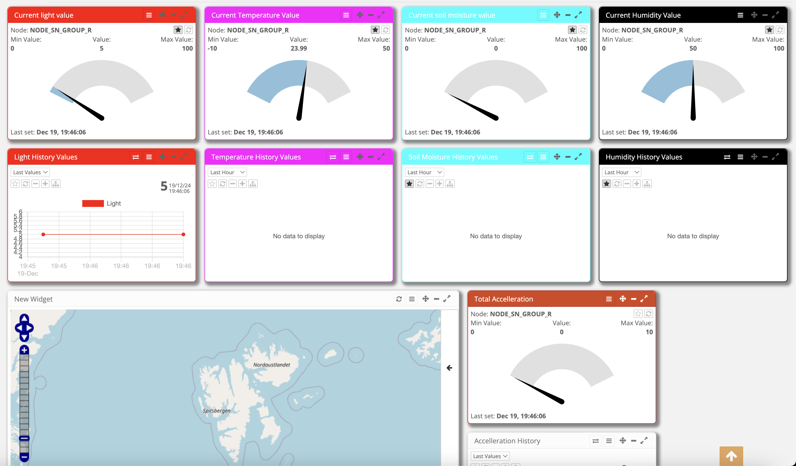

# Plant System Network

## Overview

This project implements a LoRaWAN-based system to monitor environmental and motion data using a hardware node equipped with sensors. The system collects data, structures it into a 30-byte payload, and transmits it to a ResIot server for parsing, visualization, and further analysis. The project demonstrates effective sensor integration, communication, and dashboard creation, making it a comprehensive solution for IoT monitoring.

## Features

- Data Collection: Reads data from various sensors, including light, humidity, temperature, accelerometer, soil moisture, RGB color, and GPS.
- Efficient Data Structuring: Uses a packed struct to minimize data size while preserving precision.
- LoRaWAN Communication: Transmits sensor data to the ResIot server and receives commands for the node.
- ResIot Integration: Visualizes data through a dashboard with gauges and graphs for real-time and historical insights.

## System Workflow

1. Data Collection: The hardware node reads sensor data and structures it into a 30-byte payload.
2. Data Transmission: The payload is sent via LoRaWAN to the ResIot server.
3. Data Parsing: A Lua script processes the received payload to extract sensor data.
4. Visualization: Parsed data is displayed on the ResIot dashboard using widgets for real-time monitoring and historical trends.
5. Node Control: Commands from the server are received and executed by the node, such as changing RGB LED colors.

## How to use

1. Setup Hardware: Connect sensors to the LoRaWAN-enabled board and configure power and communication lines.
2. Flash Code: Upload the provided code to the hardware node.
3. Configure ResIot: Set up a network server, node configuration, and Lua script in the ResIot framework.
4. Monitor Data: Use the ResIot dashboard to visualize real-time and historical data.
5. Send Commands: Control node behavior via server commands (e.g., change RGB LED color).

    

## Future Enhancements

- Add additional sensors for expanded monitoring capabilities.
- Implement edge processing on the node for real-time analytics.
- Enhance dashboard features with more advanced visualizations.

# Author

Stefano Morano for the Sensor Network Project in Universidad Politecnica de Madrid
